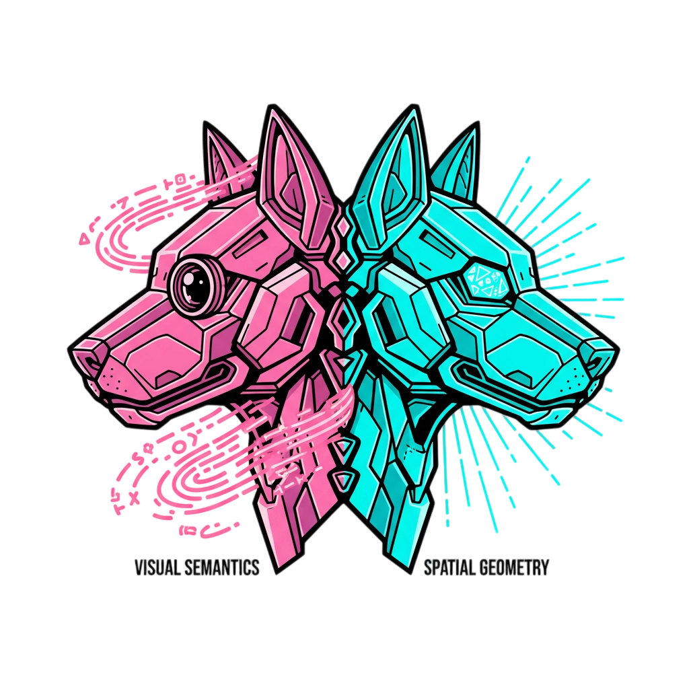

<h1>JanusVLN: Decoupling Semantics and Spatiality with Dual Implicit Memory for Vision-Language Navigation</h1>

[Shuang Zeng](https://scholar.google.com/citations?user=91lbdPcAAAAJ&hl=zh-CN)1,2,
[Dekang Qi](https://scholar.google.com/citations?user=fOU1xMAAAAAJ&hl=zh-CN&oi=ao)1,
[Xinyuan Chang](https://scholar.google.com.hk/citations?user=5OnPBVYAAAAJ&hl=zh-CN)1,
[Feng Xiong](https://scholar.google.com/citations?hl=zh-CN&user=_X4MQ-gAAAAJ)1,
Shichao Xie1,
Xiaolong Wu1,
Shiyi Liang1,2,
Mu Xu1,
[Xing Wei](https://scholar.google.com.hk/citations?user=KNyC5EUAAAAJ&hl=zh-CN&oi=ao/)2

1Amap, Alibaba Group,
2Xi’an Jiaotong University

https://github.com/user-attachments/assets/bc477e20-2dd2-4927-b382-f483f578f3e1

---
