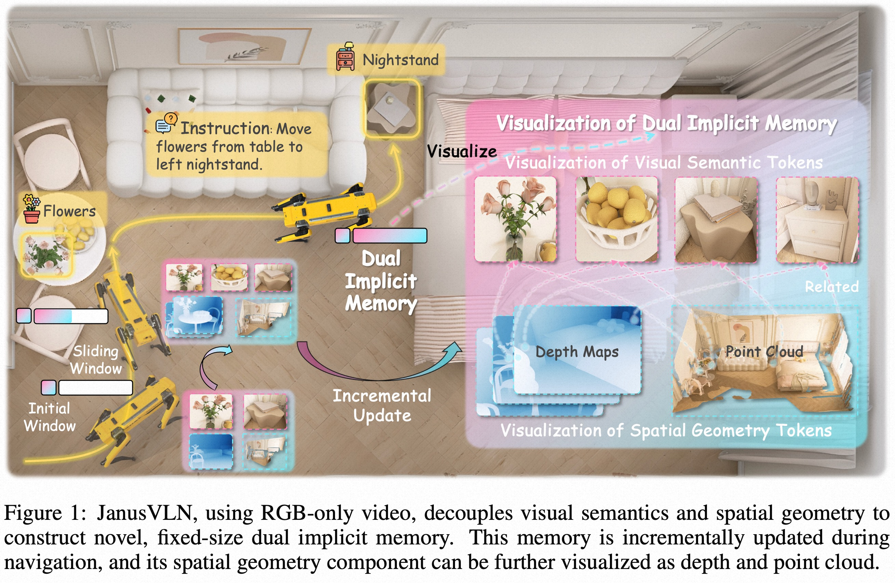

<div align="center">


<h1>JanusVLN: Decoupling Semantics and Spatiality with Dual Implicit Memory for Vision-Language Navigation</h1>

[Shuang Zeng](https://scholar.google.com/citations?user=91lbdPcAAAAJ&hl=zh-CN)<sup>1,2</sup>,
[Dekang Qi](https://scholar.google.com/citations?user=fOU1xMAAAAAJ&hl=zh-CN&oi=ao)<sup>1</sup>,
[Xinyuan Chang](https://scholar.google.com.hk/citations?user=5OnPBVYAAAAJ&hl=zh-CN)<sup>1</sup>,
[Feng Xiong](https://scholar.google.com/citations?hl=zh-CN&user=_X4MQ-gAAAAJ)<sup>1</sup>,
Shichao Xie<sup>1</sup>,
Xiaolong Wu<sup>1</sup>,
Shiyi Liang<sup>1,2</sup>,
Mu Xu<sup>1</sup>,
[Xing Wei](https://scholar.google.com.hk/citations?user=KNyC5EUAAAAJ&hl=zh-CN&oi=ao/)<sup>2</sup>


<sup>1</sup>Amap, Alibaba Group,
<sup>2</sup>Xi’an Jiaotong University

[](https://arxiv.org/abs/2509.22548)
[](https://miv-xjtu.github.io/JanusVLN.github.io/)
[](https://www.youtube.com/watch?v=SfrkZks_XE8)
[](https://www.modelscope.cn/models/misstl/JanusVLN_Base)
[](https://www.modelscope.cn/models/misstl/JanusVLN_Extra)
[](https://www.modelscope.cn/datasets/misstl/JanusVLN_Trajectory_Data)

https://github.com/user-attachments/assets/bc477e20-2dd2-4927-b382-f483f578f3e1

</div>


## 💡 Introduction
**JanusVLN** is a novel VLN framework and the first to feature a **dual implicit memory**. Inspired by the implicit scene representation in human navigation, which integrates left-brain semantic understanding with right-brain spatial cognition, JanusVLN constructs two complementary, fixed-size, compact neural memory. JanusVLN steers VLN research from 2D semantics-dominant toward 3D spatial-semantisynergy, a critical direction for developing next-generation spatial embodied agents.


<div style="text-align: center;">
  
</div>

## 📢 News
[2025-11-06] Due to the previous upload of incorrect weights for the `JanusVLN_Extra` model, if you need to directly infer, please download the correct weights from [JanusVLN_Extra](https://www.modelscope.cn/models/misstl/JanusVLN_Extra) again.

## Table of Contents
- [🛠️ Installation](#-Installation)
- [📦 Data Preparation](#-Data-Preparation)
- [🏆 Model Zoo](#-Model-Zoo)
- [🚀 Training](#-Training)
- [📈 Evaluation](#-Evaluation)
- [📜 Citing](#-Citing)
<p align="right"><a href="#readme-top"></a></p>

## 🛠️ Installation

Create the required environment through the following steps:

```bash
git clone https://github.com/MIV-XJTU/JanusVLN.git && cd JanusVLN

conda create -n janusvln python=3.9 -y && conda activate janusvln

conda install habitat-sim==0.2.4 withbullet headless -c conda-forge -c aihabitat

git clone --branch v0.2.4 https://github.com/facebookresearch/habitat-lab.git
cd habitat-lab
pip install -e habitat-lab
pip install -e habitat-baselines
cd ..

# CUDA 12.4
pip install torch==2.5.1 torchvision==0.20.1 torchaudio==2.5.1 --index-url https://download.pytorch.org/whl/cu124

pip install -r requirements.txt
# Install JanusVLN
pip install -e .
```
<p align="right"><a href="#readme-top"></a></p>

## 📦 Data Preparation

1、**Scene Datasets**
- For **R2R**, **RxR**: Download the MP3D scenes from the [official project page](https://niessner.github.io/Matterport/), and place them under `data/scene_datasets/mp3d/`.
- For **ScaleVLN**: Download the HM3D scenes from the [official github page](https://github.com/matterport/habitat-matterport-3dresearch), and place the `train` split under `data/scene_datasets/hm3d/`.

2、**VLN-CE Episodes**  
   Download the VLN-CE episodes and extract them into the `data/datasets/` directory:
   - [r2r](https://drive.google.com/file/d/1fo8F4NKgZDH-bPSdVU3cONAkt5EW-tyr/view) (Rename `R2R_VLNCE_v1-3_preprocessed/` -> `r2r/`)
   - [rxr](https://drive.google.com/file/d/145xzLjxBaNTbVgBfQ8e9EsBAV8W-SM0t/view) (Rename `RxR_VLNCE_v0/` -> `rxr/`)
   - [scalevln](https://huggingface.co/datasets/cywan/StreamVLN-Trajectory-Data/blob/main/ScaleVLN/scalevln_subset_150k.json.gz) (Follow the StreamVLN to convert a subset of the ScaleVLN dataset into the VLN-CE format.)

3、**Collected Trajectory Data**

We provide pre-collected observation-action trajectory data for training. R2R and RxR are collected following VLN-CE. ScaleVLN is collected following StreamVLN. DAgger data is collected using [JanusVLN_Base](https://www.modelscope.cn/models/misstl/JanusVLN_Base). Note: It is best to collect DAgger data using your own base model. Download the collected trajectory data from [ModelScope](https://www.modelscope.cn/datasets/misstl/JanusVLN_Trajectory_Data) and extract it to the `data/trajectory_data/` and `data/dagger_data/` directory.

Your final folder structure should look like this:
```bash
data/
├── datasets/
│   ├── r2r/
│   │   ├── train/
│   │   ├── val_seen/
│   │   │   └── val_seen.json.gz
│   │   └── val_unseen/
│   │       └── val_unseen.json.gz
│   ├── rxr/
│   │   ├── train/
│   │   ├── val_seen/
│   │   │   ├── val_seen_guide.json.gz
│   │   │   └── ...
│   │   └── val_unseen/
│   │       ├── val_unseen_guide.json.gz
│   │       └── ...
│   └── scalevln/
│       └── scalevln_subset_150k.json.gz
├── scene_datasets/
│   ├── hm3d/
│   │   ├── 00000-kfPV7w3FaU5/
│   │   ├── 00001-UVdNNRcVyV1/
│   │   └── ...
│   └── mp3d/
│       ├── 17DRP5sb8fy/
│       ├── 1LXtFkjw3qL/
│       └── ...
├── trajectory_data/
│   ├── R2R-CE-640x480/
│   │   └── images/   
│   ├── RxR-CE-640x480/
│   │   └── images/ 
│   └── ScaleVLN/
│       ├── images/
│       └── annotations.json
└── dagger_data/
    ├── R2R/
    │   ├── images/
    │   └── annotations.json
    └── RxR/
        ├── images/
        └── annotations.json
```


4、**Build Datasets**

Construct a base dataset that only includes R2R-CE and RxR-CE:

```bash
python create_data/create_data.py
```

Finally, the dataset information needs to be configured in the file `src/qwen_vl/data/__init__.py`.

<p align="right"><a href="#readme-top"></a></p>

## 🏆 Model Zoo
We have separately provided two sets of JanusVLN model weights to distinguish whether additional data is used or not:

<table border="0">
    <tr>
        <th>Model</th>
        <th>Data</th>
        <th>Name</th>
    </tr>
    <hr style="border: 2px solid black;">
    <tr>
        <td rowspan="3"><b>JanusVLN</b></td>
        <td>R2R-CE,RxR-CE</td>
        <td><a href="https://www.modelscope.cn/models/misstl/JanusVLN_Base">JanusVLN_Base</a></td>
    </tr>
    <tr>
        <td>R2R-CE,RxR-CE,DAgger,ScaleVLN</td>
        <td><a href="https://www.modelscope.cn/models/misstl/JanusVLN_Extra">JanusVLN_Extra</a></td>
    </tr>
</table>


<p align="right"><a href="#readme-top"></a></p>

## 🚀 Training

1. **Base Training**

    Use the base data to train the base model:

    ```bash
    bash scripts/train.sh
    ```
2. **Dagger Collection**

    Collecting DAgger data using the base model:

    ```bash
    bash scripts/dagger.sh
    ```

    Construct extra dataset:
    
    ```bash
    python create_data/create_data.py --use_extra_data
    ```

    It is also necessary to configure the dataset information in the file `src/qwen_vl/data/__init__.py`.
2. **Extra Training**

    Continue training on extra data on top of the base model:

    ```bash
    bash scripts/train_extra.sh
    ```

<p align="right"><a href="#readme-top"></a></p>

## 📈 Evaluation
Use multiple GPUs to infer the model for evaluation:

```bash
bash scripts/evaluation.sh
```

<p align="right"><a href="#readme-top"></a></p>


## 📜 Citing

If you find FSDrive is useful in your research or applications, please consider giving us a star 🌟 and citing it by the following BibTeX entry:

```
@article{zeng2025janusvln,
            title={JanusVLN: Decoupling Semantics and Spatiality with Dual Implicit Memory for Vision-Language Navigation},
            author={Zeng, Shuang and Qi, Dekang and Chang, Xinyuan and Xiong, Feng and Xie, Shichao and Wu, Xiaolong and Liang, Shiyi and Xu, Mu and Wei, Xing},
            journal={arXiv preprint arXiv:2509.22548},
            year={2025}
            }
```
<p align="right"><a href="#readme-top"></a></p>


## 🙏 Acknowledgement
Our work is primarily based on the following codebases:[Qwen2.5-VL](https://github.com/QwenLM/Qwen3-VL), [VGGT](https://github.com/facebookresearch/vggt), [StreamVLN](https://github.com/InternRobotics/StreamVLN), [VG-LLM](https://github.com/LaVi-Lab/VG-LLM). We are sincerely grateful for their work.

